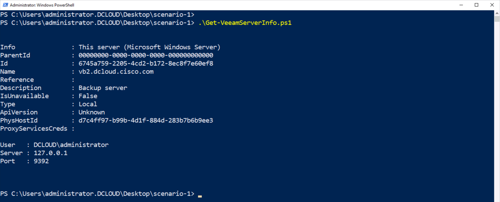
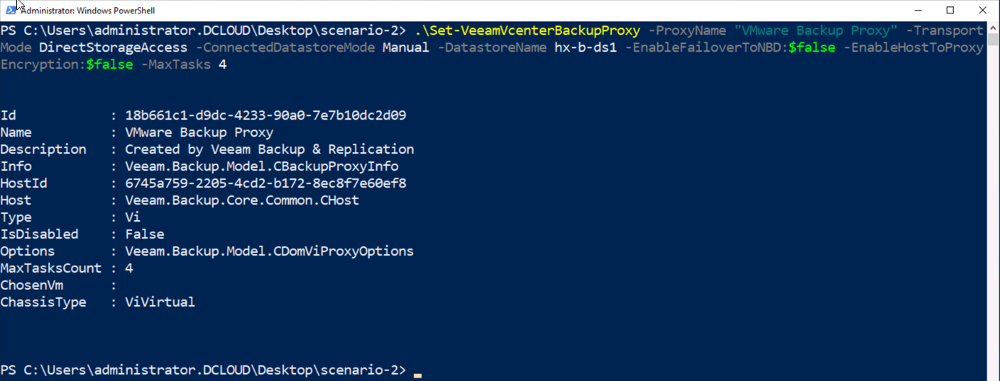
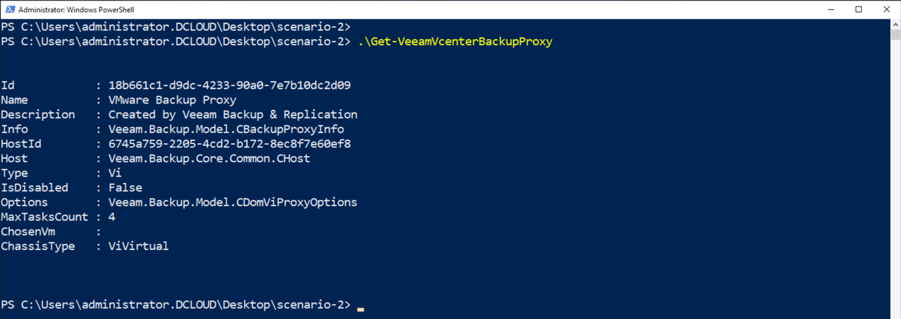
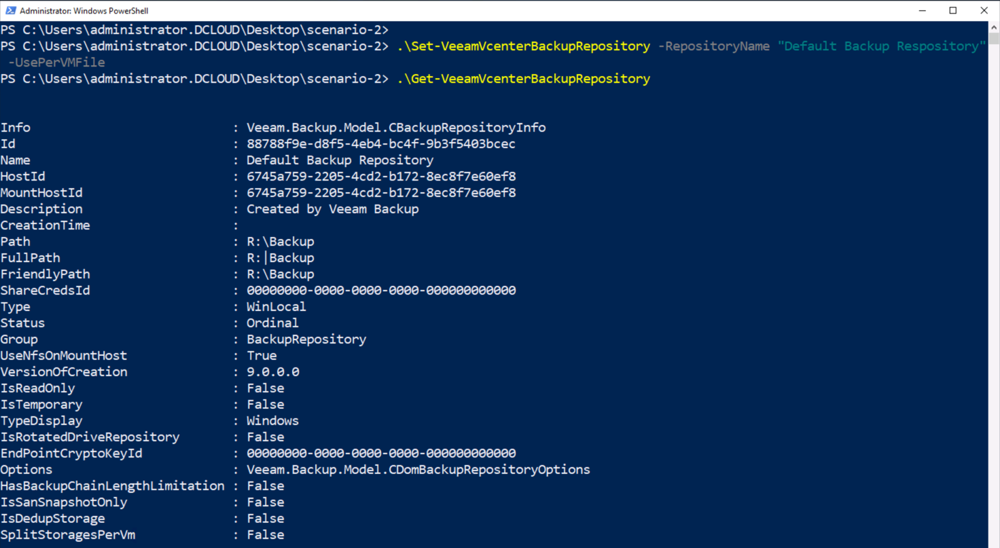
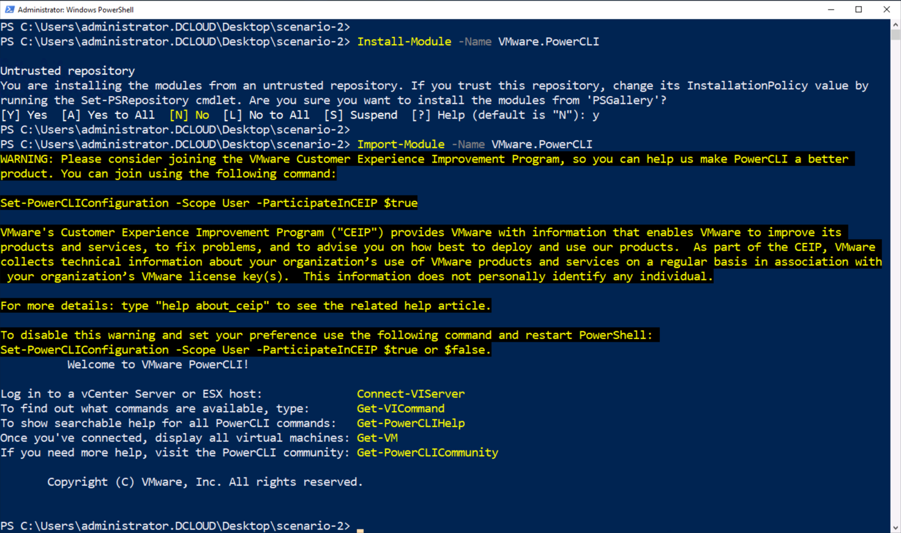
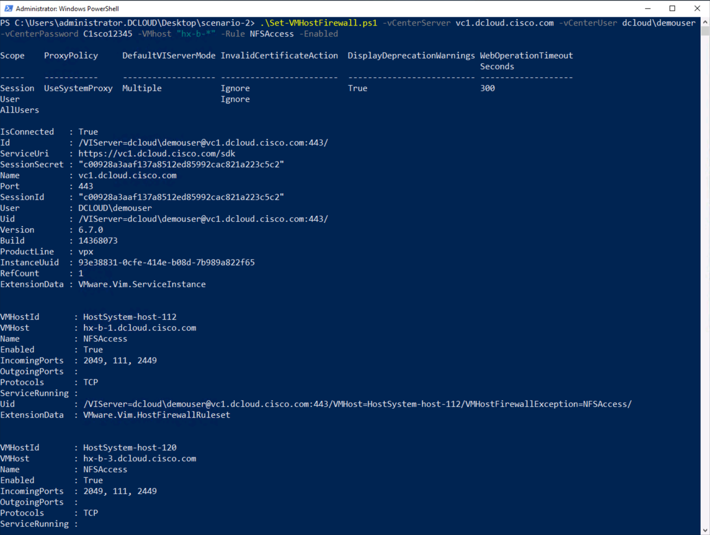

# PowerShell Scripts for dCloud Cisco® HyperFlex 4.0 with Veeam Integration v1 Lab

## Cisco HyperFlex™
Cisco HyperFlex™ is part of a complete data center strategy that uses hyperconvergence architecture models to solve basic business challenges of data optimization, operational efficiency, and adaptability. Because it is built on the Cisco UCS® platform, it allows unified network management using skillsets that are already present in the organization. It is scalable, adaptable, and completely hyperconverged – providing the three layers of Network, Compute & Storage intelligently integrated into a single solution for faster application deployment.

## Veeam
Veeam Backup & Replication can be deployed and configured with backup server, proxy and repositories on Cisco UCS. Veeam orchestrates jobs to create backups and/or replicas for the provisioning of immediate data-protection. Manage all your backups and data from a single console with one solution that backs up your data, no matter where it is. Achieve all your data protection SLAs while reducing costs.

Veeam software can be downloaded for free from https://www.veeam.com/downloads.html. For this lab, Veeam Availability Suite, which includes Veeam Backup & Replication and Veeam ONE, has been downloaded

## Lab Scenarios with Veeam PowerShell Extension
The [Cisco® HyperFlex 4.0 with Veeam Integration v1 lab](https://dcloud2-rtp.cisco.com/content/demo/630524?returnPathTitleKey=content-view) is designed to take the lab user through the following scenarios

- Scenario 1. Install Veeam Backup & Replication
- Scenario 2. Add Cisco HyperFlex Storage to Veeam Backup & Replication
- Scenario 3. Perform a Backup
- Scenario 4. Perform a Restore
- Scenario 5. VM Replication

The Lab user guide details the each of these operations. Specifying the steps the user must take to complete each scenario.

Several of the steps can be completed programmatically using the Veeam PowerShell extension. Where a step can be completed with the Veeam PowerShell extension a script has been added to this repository.

The Veem PowerShell extension is documented [here](https://helpcenter.veeam.com/docs/backup/powershell/cmdlets.html?ver=95u4). All the PowerShell scripts in the repository that interact with Veeam are using Cmdlets from the Veeam extension.

This repository is separated into scenarios to match with the methodology in the dCloud lab guide. To be able to utilize the Veeam PowerShell extension it needs to be enabled in a PowerShell environment.

## Enable the Veeam PowerShell Extension
The Veeam PowerShell Extension is installed as part of the Veeam Availability Suite. Use the Add-PSSnapin PowerShell Cmdlet to load the Veeam PowerShell Cmdlets.

1. Launch a PowerShell window as an administrator on the `vb2`desktop

  - ***Right-Click*** on `Windows PowerShell`

  - ***Click*** on `More`

  - ***Click*** on `Run as administrator`

  

1. Load the Veeam PowerShell extension

  - At the PowerShell Prompt type,

  - `Add-PSSnapin VeeamPSSnapin`

  

## Download the Veeam PowerShell Scripts
To use the scripts in the dCloud environment, download them from Github.

1. Download the Github repository from [here](https://github.com/movinalot/dcloud-cisco-hyperflex-veeam-integration/archive/master.zip)

2. Unzip the repository

## Set the Script Execution Policy
Downloaded scripts will typically throw an error when running them, set the script execution policy on the dCloud `vb2` desktop

1. Change the PowerShell script execution policy

  - At the prompt type,

  - `Set-ExecutionPolicy -ExecutionPolicy Bypass`

  

## Scenario 1. Install Veeam Backup & Replication
The purpose of this scenario is to allow Veeam Backup & Replication gain visibility into the virtual infrastructure.

### Add Managed Servers
- **Steps 6 through 13** - Add a vCenter server to Veeam. This can be accomplished by using the `Add-VeeamVCServer.ps1` script.

  ```
  Add-VeeamVCServer.ps1 -vCenterServer vc1.dcloud.cisco.com -vCenterUser dcloud\demouser -vCenterPassword C1sco12345
  ```

  

- **Step 14** - Inventory View in Veeam. An inventory view similar to the one shown in the GUI can be achieved by using the `Get-VeeamInventory.ps1`

  ```
  Get-VeeamInventory.ps1 -PathFilter "*HX-DC-B*"
  ```

  

### Additional Scripts
Additional Scripts have been provided to view Veeam server information and to remove the vCenter Server from Veeam. Look at the example in the code file to see an example of how the script can be run.

- Get Veeam Server Information - `Get-VeeamServerInfo.ps1` will display information about the Veeam Server.

  

- Remove vCenter Server from Veeam - `Remove-VeeamVCServer.ps1` removes the vCenter server supplied on the command line. The command below will remove the vCenter server that was added in steps 6 through 13. If you try the script, be sure to re-add the vCenter server when you continue the lab.

  ```
  Remove-VeeamVCServer.ps1 -vCenterServer vc1.dcloud.cisco.com
  ```

## Scenario 2. Add Cisco HyperFlex Storage to Veeam Backup & Replication
The purpose of this scenario is to add the HyperFlex storage platform to Veeam Backup & Replication, which will allow the HyperFlex native snapshot integration for faster backups.

These scripts are located in the directory `scenario-2`

### Modify VMware Backup Proxy
Backup proxies with multi-core CPUs can handle more concurrent tasks. For example, for a 4-core CPU, it is recommended to specify a maximum of 4 concurrent tasks minus two (for operating systems functions), for an 8-core CPU — 8 concurrent tasks minus two. When defining the number of concurrent tasks, keep in mind network traffic throughput in your virtual infrastructure.

- **Steps 1 through 9** - Modify VMware Backup Proxy. This can be accomplished by using the `Set-VeeamVcenterBackupProxy.ps1` script.

  ```
  Set-VeeamVcenterBackupProxy.ps1 -ProxyName "VMware Backup Proxy" -TransportMode DirectStorageAccess -ConnectedDatastoreMode Manual -DatastoreName hx-b-ds1 -EnableFailoverToNBD:$false -EnableHostToProxyEncryption:$false -MaxTasks 4
  ```

  

- An additional script, `Get-VeeamVcenterBackupProxy.ps1` is available to validate that the vCenter Backup Proxy was modified.

  

### Add a Veeam Repository
A Veeam Repository is a location where the backup files will be stored. It can be on a Windows server (with attached storage), a Linux server running NFS, a CIFS/SMB share, or an integrated deduplication appliance.

- **Steps 10 through 16** - Add a Veeam Repository. This can be accomplished by using the `Set-VeeamVcenterBackupRepository.ps1` script.

- Since the Veeam Cmdlet to add the backup repository does not create and output an additional script, `Get-VeeamVcenterBackupRepository.ps1` is available to validate that the vCenter Backup Repository was added.

  

### HyperFlex Snapshot Integration
HyperFlex snapshot integration – unique to Veeam Backup & Replication – allows backup jobs to take advantage of native HX snapshots, providing faster backups with almost no impact on the production environment. This allows you to take backups much more frequently than conventional storage systems and dramatically improve the RPO (Recovery Point Objectives) of the application.

This script requires the `VMware PowerCli PowerShell` modules to be installed and imported.

  1. Install the VMware PowerCli Modules

    - Run the Cmdlet `Install-Module -Name VMware.PowerCli`

    - Answer "y" to **trust** the modules from **PSGallery**

  2. Import the VMware PowerCli Modules

    - Run the Cmdlet `Import-Module -Name VMware.PowerCli`

    The VMware PowerCli modules are now installed and imported. Installtion is only required one time, however each time a PowerShell session is started the modules must be imported. This is similar to the process of adding the Veeam extension.

  

### Configure NFSAccess Firewall Rules
The IO Visor is a Cisco HyperFlex software module that runs on every ESXi host that is part of the Cisco HyperFlex cluster. It presents HyperFlex NFS datastores to the ESXi hosts and optimizes the data paths in the HyperFlex cluster. Backup over IO Visor is the preferred method as it provides the high speed of VM data reading and balances the load across the HyperFlex cluster. Access to the IO Visor from Veeam Backup & Replication requires a change in the firewall rules on each ESXi host or node on the HyperFlex cluster. This is accomplished by enabling NFSAccess.

- **Steps 1 through 9** - Configure NFSAccess Firewall Rules. This can be accomplished by using the `Set-VMHostFirewall.ps1` script.

  ```
  Set-VMHostFirewall.ps1 -vCenterServer vc1.dcloud.cisco.com -vCenterUser dcloud\demouser -vCenterPassword C1sco12345 -VMhost "hx-b-*" -Rule NFSAccess -Enabled
  ```

  

### Add HX Data Platform Storage to Veeam
As the time this collection of scripts was created Veeam did not provide a Cmdlet to add HX Data Platform Storage to Veeam.

Please follow the steps in the dCloud user guide, this repository will be updated when the Veeam Cmdlet is available.

## Scenario 3. Perform a Backup
Coming Soon...
