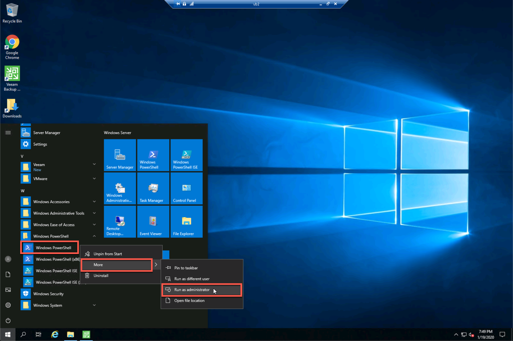
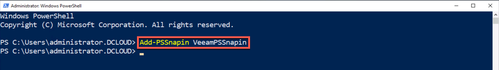
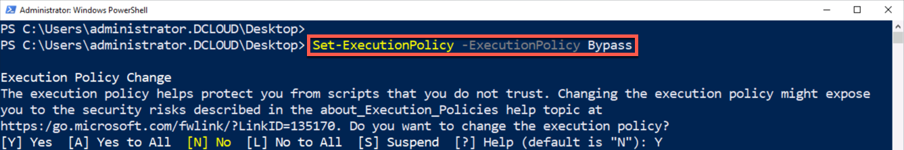
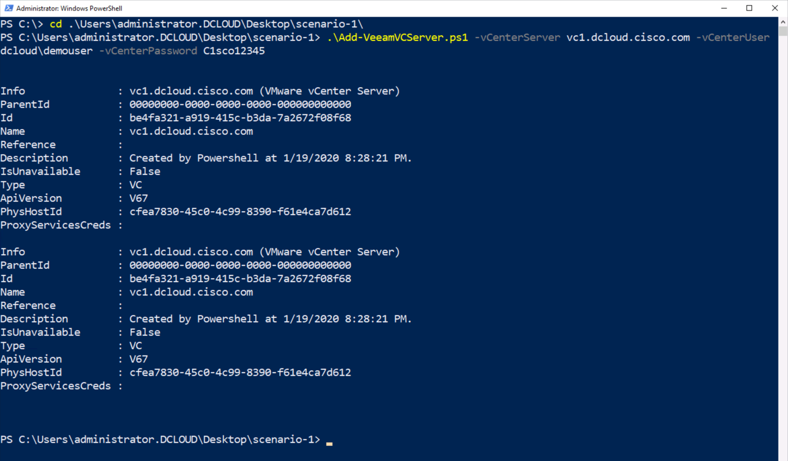
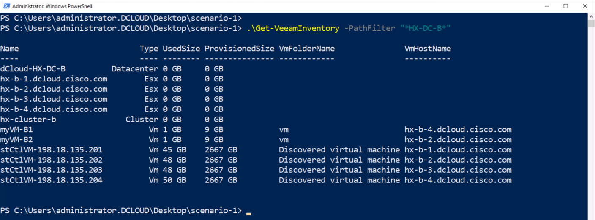

# PowerShell Scripts for dCloud Cisco® HyperFlex 4.0 with Veeam Integration v1 Lab

## Cisco HyperFlex™
Cisco HyperFlex™ is part of a complete data center strategy that uses hyperconvergence architecture models to solve basic business challenges of data optimization, operational efficiency, and adaptability. Because it is built on the Cisco UCS® platform, it allows unified network management using skillsets that are already present in the organization. It is scalable, adaptable, and completely hyperconverged – providing the three layers of Network, Compute & Storage intelligently integrated into a single solution for faster application deployment.

## Veeam
Veeam Backup & Replication can be deployed and configured with backup server, proxy and repositories on Cisco UCS. Veeam orchestrates jobs to create backups and/or replicas for the provisioning of immediate data-protection. Manage all your backups and data from a single console with one solution that backs up your data, no matter where it is. Achieve all your data protection SLAs while reducing costs.

Veeam software can be downloaded for free from https://www.veeam.com/downloads.html. For this lab, Veeam Availability Suite, which includes Veeam Backup & Replication and Veeam ONE, has been downloaded

## Lab Scenarios with Veeam PowerShell Extension
The [Cisco® HyperFlex 4.0 with Veeam Integration v1 lab](https://dcloud2-rtp.cisco.com/content/demo/630524?returnPathTitleKey=content-view) is designed to take the lab user through the following scenarios

- Scenario 1. Install Veeam Backup & Replication
- Scenario 2. Add Cisco HyperFlex Storage to Veeam Backup & Replication
- Scenario 3. Perform a Backup
- Scenario 4. Perform a Restore
- Scenario 5. VM Replication

The Lab user guide details the each of these operations. Specifying the steps the user must take to complete each scenario.

Several of the steps can be completed programmatically using the Veeam PowerShell extension. Where a step can be completed with the Veeam PowerShell extension a script has been added to this repository.

The Veem PowerShell extension is documented [here](https://helpcenter.veeam.com/docs/backup/powershell/cmdlets.html?ver=95u4). All the PowerShell scripts in the repository that interact with Veeam are using Cmdlets from the Veeam extension.

This repository is separated into scenarios to match with the methodology in the dCloud lab guide. To be able to utilize the Veeam PowerShell extension it needs to be enabled in a PowerShell environment.

### Enable the Veeam PowerShell Extension
The Veeam PowerShell Extension is installed as part of the Veeam Availability Suite. Use the Add-PSSnapin PowerShell Cmdlet to load the Veeam PowerShell Cmdlets.

1. Launch a PowerShell window as an administrator on the `vb2`desktop

  - ***Right-Click*** on `Windows PowerShell`

  - ***Click*** on `More`

  - ***Click*** on `Run as administrator`

  

1. Load the Veeam PowerShell extension

  - At the PowerShell Prompt type,

  - `Add-PSSnapin VeeamPSSnapin`

  

### Download the Veeam PowerShell Scripts
To use the scripts in the dCloud environment, download them from Github.

1. Download the Github repository from [here](https://github.com/movinalot/dcloud-cisco-hyperflex-veeam-integration/archive/master.zip)

2. Unzip the repository

### Set the Script Execution Policy
Downloaded scripts will typically throw an error when running them, set the script execution policy on the dCloud `vb2` desktop

1. Change the PowerShell script execution policy

  - At the prompt type,

  - `Set-ExecutionPolicy -ExecutionPolicy Bypass`

  

### Scenario 1. Install Veeam Backup & Replication

#### Add Managed Servers
- **Steps 6 through 13** - Add a vCenter server to Veeam. This can be accomplished by using the `Add-VeeamVCServer.ps1` script.

```
 Add-VeeamVCServer.ps1 -vCenterServer vc1.dcloud.cisco.com -vCenterUser dcloud\demouser -vCenterPassword C1sco12345
```

  

- **Step 14** - Inventory View in Veeam. An inventory view similar to the one shown in the GUI can be achieved by using the `Get-VeeamInventory.ps1`

```
Get-VeeamInventory.ps1 -PathFilter "*HX-DC-B*"
```

  

#### Additional Scripts
Additional Scripts have been provided to view Veeam server information and to remove the vCenter Server from Veeam. Look at the example in the code file to see an example of how the script can be run.

- Get Veeam Server Information - `Get-VeeamServerInfo.ps1` will display information about the Veeam Server.

```
PS C:\Users\administrator.DCLOUD\Desktop\scenario-1> .\Get-VeeamServerInfo.ps1


Info               : This server (Microsoft Windows Server)
ParentId           : 00000000-0000-0000-0000-000000000000
Id                 : 6745a759-2205-4cd2-b172-8ec8f7e60ef8
Name               : vb2.dcloud.cisco.com
Reference          :
Description        : Backup server
IsUnavailable      : False
Type               : Local
ApiVersion         : Unknown
PhysHostId         : d7c4ff97-b99b-4d1f-884d-283b7b6b9ee3
ProxyServicesCreds :

User   : DCLOUD\administrator
Server : 127.0.0.1
Port   : 9392
```

- Remove vCenter Server from Veeam - `Remove-VeeamVCServer.ps1` removes the vCenter server supplied on the command line. The command below will remove the vCenter server that was added in steps 6 through 13. If you would like to test the Cmdlet, be sure to re-add the vCenter server when you continue the lab.

```
Remove-VeeamVCServer.ps1 -vCenterServer vc1.dcloud.cisco.com
```
